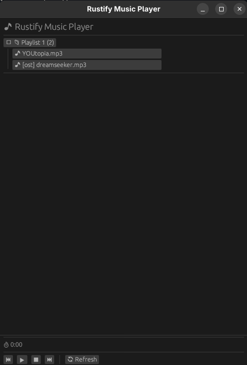

# 🎵 Rustify Music Player

A modern, cross-platform music player built with Rust and egui. Rustify provides a clean interface for organizing and playing your music collection with playlist support and drag-and-drop functionality.



## ✨ Features

- 🎶 **Multi-format Support**: Play MP3, WAV, FLAC, and OGG files
- 📁 **Folder-based Playlists**: Organize your music in folders that act as playlists
- 🔄 **Auto-advance**: Automatically plays the next song when current song finishes
- 🎛️ **Playback Controls**: Play, pause, stop, next, and previous track controls
- 📊 **Real-time Progress**: Visual progress tracking with time display
- 🖱️ **Drag & Drop**: Move songs between playlists with drag and drop
- 🎨 **Clean UI**: Modern, responsive interface built with egui
- ⚡ **Fast & Lightweight**: Written in Rust for optimal performance

## 🚀 Getting Started

### Prerequisites

- Rust 1.70 or higher
- Git (for cloning the repository)
- Audio system dependencies (usually pre-installed on most systems)
- A music collection in supported formats (MP3, WAV, FLAC, OGG)

### Installation

1. Clone the repository:
```bash
git clone https://github.com/darkobyte/Rustify.git
cd Rustify
```

2. Build and run:
```bash
cargo run --release
```

### Music Directory Setup

By default, Rustify looks for music in `~/Downloads/music/`. You can organize your music as follows:

```
~/Downloads/music/
├── Rock/
│   ├── song1.mp3
│   └── song2.mp3
├── Jazz/
│   ├── track1.flac
│   └── track2.wav
└── Classical/
    └── symphony.ogg
```

Each folder becomes a playlist in the interface.

## 🎮 Usage

### Playing Music
- Click on any song to start playing
- Use the control buttons at the bottom for playback control
- Songs automatically advance to the next track in the same playlist

### Managing Playlists
- Click folder names to expand/collapse playlists
- Drag songs between folders to move them to different playlists
- The file system is updated when you move songs between folders

### Keyboard Shortcuts
- `Space`: Play/Pause (coming soon)
- `→`: Next track (coming soon)
- `←`: Previous track (coming soon)

*Note: Keyboard shortcuts are planned for future releases. Currently, use the UI controls.*

## 🛠️ Development

### Building from Source

```bash
# Debug build
cargo build

# Release build
cargo build --release

# Run with cargo
cargo run
```

### Project Structure

```
src/
├── main.rs           # Application entry point
├── app.rs            # Main application logic
├── models/           # Data structures
│   ├── song.rs       # Song model with duration tracking
│   └── folder.rs     # Folder/playlist model
├── player/           # Audio engine
│   └── music_player.rs  # Core playback functionality
├── ui/               # User interface components
│   ├── controls.rs   # Playback controls
│   └── song_list.rs  # Song list and folder view
└── utils/            # Utility functions
    └── format.rs     # Time and text formatting
```

## 🤝 Contributing

We welcome contributions! Here's how you can help:

### Ways to Contribute
- 🐛 **Bug Reports**: Found a bug? Please open an issue
- 💡 **Feature Requests**: Have an idea? We'd love to hear it
- 🔧 **Code Contributions**: Submit pull requests for bug fixes or new features
- 📚 **Documentation**: Help improve our documentation
- 🎨 **UI/UX**: Suggest interface improvements

### Development Guidelines
1. Fork the repository
2. Create a feature branch (`git checkout -b feature/amazing-feature`)
3. Make your changes
4. Add tests if applicable
5. Commit your changes (`git commit -m 'Add amazing feature'`)
6. Push to the branch (`git push origin feature/amazing-feature`)
7. Open a Pull Request

### Code Style
- Follow Rust's official style guidelines
- Use `cargo fmt` to format your code
- Run `cargo clippy` to check for common issues
- Ensure all tests pass with `cargo test`

## 📋 Requirements

### System Dependencies
- **Linux**: ALSA development libraries
  ```bash
  # Ubuntu/Debian
  sudo apt install libasound2-dev pkg-config
  
  # Fedora/CentOS
  sudo dnf install alsa-lib-devel pkg-config
  
  # Arch Linux
  sudo pacman -S alsa-lib pkg-config
  ```
- **Windows**: No additional dependencies required
- **macOS**: No additional dependencies required

### Rust Dependencies
All Rust dependencies are managed through Cargo and will be automatically installed:
- `eframe` - Cross-platform GUI framework
- `egui` - Immediate mode GUI library
- `rodio` - Audio playback library
- `serde` - Serialization framework

## 📄 License

This project is licensed under the MIT License - see the [LICENSE](LICENSE) file for details.

**TL;DR**: You can use, modify, and distribute this software freely, including for commercial purposes. Just include the original license notice.

## 🙏 Acknowledgments

- Built with [egui](https://github.com/emilk/egui) - Immediate mode GUI framework
- Audio powered by [rodio](https://github.com/RustAudio/rodio) - Pure Rust audio library
- Inspired by modern music players and the Rust community

## 📞 Support

- 📧 **Issues**: [GitHub Issues](https://github.com/darkobyte/Rustify/issues)
- 💬 **Discussions**: [GitHub Discussions](https://github.com/darkobyte/Rustify/discussions)
- 📖 **Documentation**: Check the docs folder for detailed guides
- 🌟 **Star the project**: If you find Rustify useful, please give it a star!

---

Made with ❤️ and 🦀 Rust